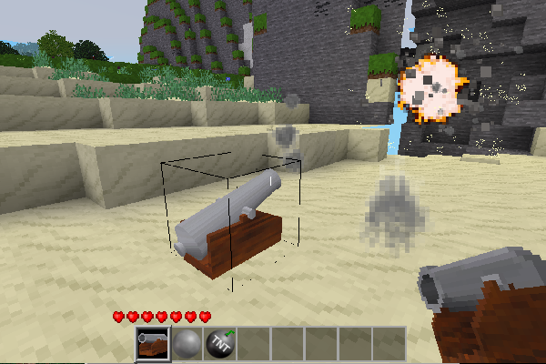
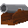

# Cannon 73

## Overview

A Minetest mod that provides shootable and aimable cannons. It is compatible with Minetest Game, MineClone2, xaenvironment and similar games.

## Items

| Name             | ID                 | Image                                 | Description                                                                            |
| ---------------- | ------------------ | ------------------------------------- | -------------------------------------------------------------------------------------- |
| Cannon           | cannon73:cannon    |  | Cannon Node                                                                            |
| Cannon Shell     | cannon73:shell     |   | Cannon projectile that destroys entities and nodes                                     |
| Cannon Ball      | cannon73:ball      |    | Cannon projectile that destroys entities                                               |
| Cannon Gunpowder | cannon73:gunpowder |   | Item that powers cannons. This is only registered if no gunpowder is found in the game |

## Operation

First place a cannon. Put gunpowder into the gunpowder slot and a projectile into the projectile slot. Move the yaw and pitch sliders to adjust the cannon's aim. Press the fire button to fire the cannon. Cannons can also be triggered by a mesecon signal. If the projectile is a Cannon Shell, it will explode on impact and will destroy nodes and damage entitles in the area of the explosion. If the shell is in the air for 3 seconds with out making contact with anything it will automatically explode. If the projectile is a Cannon Ball, it will explode on impact and will damage entities in the explosion area. If the ball is in the air for more than 10 seconds then the cannon ball will be eliminated. If you place multiple balls or shells in the projectile slot, the explosion area will be increased. If the projectile is a stack of nodes, on impact, the nodes will be placed near the impact site. Sometimes some of the nodes are eliminated if no space can be found to place them. If the projectile is a stack of mob spawners, mobs will be spawned at the impact site. The speed of the projectile is increased proportionately to the amount of gunpowder that is supplied.
